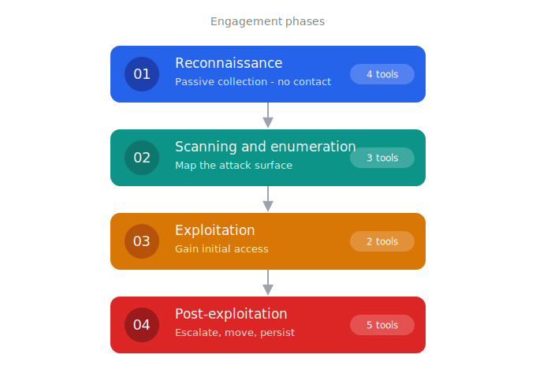

# Red Team Toolkit

Tools are organized by engagement phase — each folder has its own README with the full tool list.

  

| Phase | Contents |
|-------|----------|
| [01_Reconnaissance](01_Reconnaissance/) | Passive collection: WHOIS, subdomains, emails |
| [02_Scanning_and_Enumeration](02_Scanning_and_Enumeration/) | Active mapping: CVE scanning, directory brute-force, network intelligence |
| [03_Exploitation](03_Exploitation/) | Exploit suggestion and payload generation |
| [04_Post_Exploitation](04_Post_Exploitation/) | Privilege escalation, lateral movement, persistence, reverse shells |

[Utilities](Utilities/) sits outside the phase flow — cross-phase helpers (encoding, hash cracking, password auditing, phishing detection) you reach for throughout an engagement.

For educational and authorized security testing use only:)
